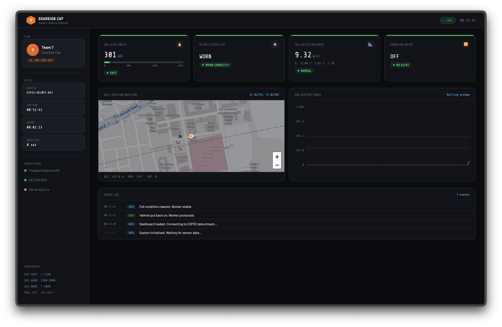

<h1>Guardian Cap ⛑</h1>

Guardian Cap is an *ESP32-based smart safety helmet* developed to improve worker safety in hazardous industrial environments such as oil refineries.

The system continuously monitors gas levels, detects whether the helmet is being worn, identifies falls using an MPU9250 accelerometer and gyroscope, tracks the worker’s GPS location, and warns workers when they enter predefined hazardous zones using a vibration motor.
Sensor data is transmitted to Firebase Realtime Database and displayed on a web dashboard for real-time monitoring.

**Hardware**
* ESP32 Microcontroller
* MQ-2 Gas Sensor
* MPU6050 ACcelerometer
* NEO-6M GPS Module
* IR Sensor
* Vibration Motor

**Technologies**
* Arduino C++
* Firebase 
* HTML
* CSS
* JavaScript

<b>Website</b>: [Guardian Cap](https://guardian-cap-f715b.web.app)
                   (_hosted using Firebase_)

                   
<b>Here's a quick preview!</b>

